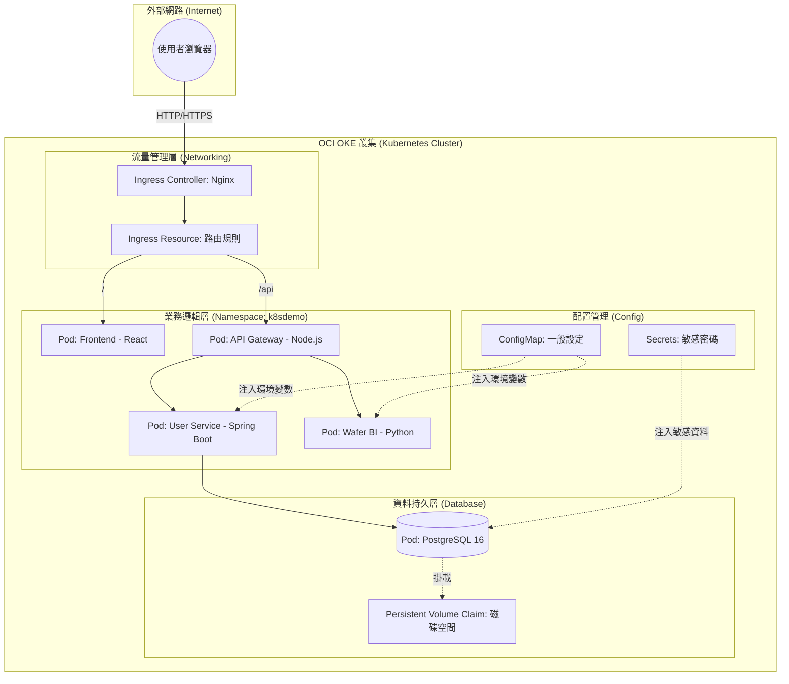

# 🎡 Kubernetes 系統架構與名詞詳解 (Wafer-BI 專案版)

這份文件旨在幫助你理解本專案在 K8S 中的運作邏輯。我們將系統比喻為一家**「大型自動化餐廳」**。

---

## 1. 系統架構圖 (Mermaid)

---

## 2. K8S 核心名詞：功能與職責

這裡我們用「餐廳」來對比 K8S 的專有名詞：

| K8S 名詞 | 餐廳比喻 | 在本專案中的職責 |
| :--- | :--- | :--- |
| **Node (節點)** | **店面實體** | 這是 OCI 提供的虛擬機 (如 Ampere ARM)，所有服務都跑在上面。 |
| **Namespace (命名空間)** | **不同部門** | 專案使用 `k8sdemo`。它像是一道圍牆，把不同專案的資源隔開，避免名字衝突。 |
| **Pod (容器組)** | **工作站 / 廚師** | K8S 的最小單位。例如一個 `Frontend Pod` 裡面跑著你的 React 網頁。**Pod 是會消失的**，壞了 K8S 會自動補一個新的。 |
| **Deployment (部署控制)** | **排班表** | 定義你要跑幾個 Pod。例如 `frontend` 設定 `replicas: 2`，K8S 就會確保永遠有 2 個前端在線上。 |
| **Service (服務入口)** | **內部分機號碼** | 因為 Pod 的 IP 會變，Service 提供一個固定的名稱（如 `postgres-service`）。後端只要撥這個號碼就能找到資料庫。 |
| **Ingress (總機/入口)** | **餐廳大門口** | 這是唯一的對外窗口。它根據網址路徑（`/` 或 `/api`）決定要把客人引導到前端還是後端。 |
| **ConfigMap (配置地圖)** | **菜單與公佈欄** | 存放不敏感的設定，如 `DB_NAME` 或 `API_URL`。修改這裡，Pod 就能讀到新設定。 |
| **Secret (秘密)** | **保險箱** | 存放敏感資料，如 `POSTGRES_PASSWORD`。它會加密存儲，只有授權的 Pod 才能讀取。 |
| **PVC (持久化磁碟)** | **倉庫/冰箱** | Pod 重啟後資料會消失，但資料庫需要存檔。PVC 就像是一個獨立的硬碟，即使 Pod 壞了，資料還是在硬碟裡。 |

---

## 3. 專案中的數據流向 (一步步解析)

1.  **請求進入**：你輸入 IP，請求打到 **Ingress Controller**。
2.  **路由分配**：
    *   路徑是 `/` -> 交給 `frontend` Service -> 轉發給其中一個 **Frontend Pod**。
    *   路徑是 `/api` -> 交給 `api-gateway` Service -> 轉發給 **API Gateway Pod**。
3.  **微服務協作**：
    *   API Gateway 收到請求，判斷這是要找用戶資料還是晶圓數據。
    *   如果是用戶請求，它會呼叫 `user-service`。
4.  **資料存取**：
    *   `user-service` 向 `postgres-service` 發送 SQL 請求。
    *   **Postgres Pod** 從 **PVC (磁碟)** 讀取數據並回傳。
5.  **回傳結果**：資料一路原路返回，最後呈現出你在網頁上看到的圖表。

---

## 4. 給學習者的建議 (如何練習？)

如果你想深入學習，可以嘗試在 Cloud Shell 玩玩看：
- **看狀態**：`kubectl get all -n k8sdemo` (看所有資源)
- **看設定**：`kubectl get configmap app-config -o yaml` (看設定檔內容)
- **看日誌**：`kubectl logs -f [pod-name] -n k8sdemo` (追蹤廚師正在做什麼)
- **動手修**：嘗試刪掉一個 Pod `kubectl delete pod [pod-name]`，觀察 K8S 是不是真的會自動生出一個新的（Self-healing）。

---
*這份文件是由 AI 協助整理，旨在讓複雜的 K8S 架構變得易於理解。*
