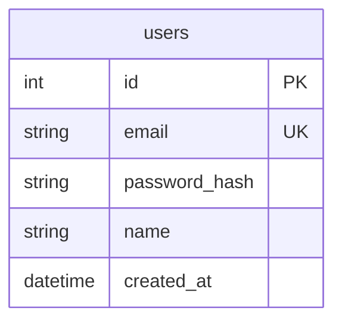

# 🗄️ Database Architecture & Schema 指南

本專案採用 **Polyglot Persistence (多語言持久化)** 策略，針對不同數據特性選擇最佳的存儲方案。

---

## 1. 關係型資料庫：PostgreSQL 16 (User Management)

*   **職責**: 存儲企業級身份數據、權限設定與業務配置。
*   **優勢**: 確保用戶註冊、修改權限時的數據具備 ACID 事務特性。

### A. 實體關係圖 (ERD)


### B. SQL DDL 腳本 (Liquibase 導入參考)
如果您需要手動建立或了解結構，以下是標準 SQL 定義：

```sql
-- 建立用戶表
CREATE TABLE IF NOT EXISTS users (
    id SERIAL PRIMARY KEY,
    email VARCHAR(255) UNIQUE NOT NULL,
    password_hash VARCHAR(255) NOT NULL,
    name VARCHAR(255) NOT NULL,
    created_at TIMESTAMP DEFAULT CURRENT_TIMESTAMP
);

-- 建立測試數據
INSERT INTO users (email, password_hash, name) 
VALUES ('admin@example.com', '$2a$10$8.UnVuG9HHgffUDAlk8Kn.2ndfJGXU511PrXvDK8XTP0R81uS.Ery', 'Admin User')
ON CONFLICT DO NOTHING;
```

### C. Liquibase ChangeLog 範例
為了導入 Liquibase，您可以建立 `src/main/resources/db/changelog/db.changelog-master.xml`：

```xml
<databaseChangeLog
    xmlns="http://www.liquibase.org/xml/ns/dbchangelog"
    xmlns:xsi="http://www.w3.org/2001/XMLSchema-instance"
    xsi:schemaLocation="http://www.liquibase.org/xml/ns/dbchangelog
    http://www.liquibase.org/xml/ns/dbchangelog/dbchangelog-4.3.xsd">

    <changeSet id="20260506-001" author="wafer-bi">
        <createTable tableName="users">
            <column name="id" type="SERIAL">
                <constraints primaryKey="true" nullable="false"/>
            </column>
            <column name="email" type="VARCHAR(255)">
                <constraints unique="true" nullable="false"/>
            </column>
            <column name="password_hash" type="VARCHAR(255)">
                <constraints nullable="false"/>
            </column>
            <column name="name" type="VARCHAR(255)">
                <constraints nullable="false"/>
            </column>
            <column name="created_at" type="TIMESTAMP" defaultValueComputed="CURRENT_TIMESTAMP"/>
        </createTable>
    </changeSet>

</databaseChangeLog>
```

---

## 2. 現代化數據湖：Delta Lake (Parquet 格式)

用於存放工業級的晶圓量測數據。

| 欄位名稱 | 型別 | 說明 |
| :--- | :--- | :--- |
| **lot_id** | String | 批次 ID (例如: Lot1) |
| **wafer_id** | String | 晶圓 ID (例如: W01) |
| **parameter** | String | 量測參數 (例如: Thickness) |
| **x** | Int | 座標 X |
| **y** | Int | 座標 Y |
| **value** | Float | 量測數值 |

### 為什麼選擇 Delta Lake 而非傳統 SQL 資料庫？
1.  **大數據吞吐量**: 傳統資料庫在處理數百萬行 Die 數據時效率較低。
2.  **開放格式**: Parquet 檔案可以被 Python、Spark 等多種工具直接讀取。
3.  **計算下推 (Push-down)**: 配合 DuckDB 或 PyArrow，實現極速掃描。

---

## 3. 數據流向圖 (Data Flow)

1.  **用戶操作** -> 由 **PostgreSQL** 驗證身分。
2.  **大數據查詢** -> 後端透過 `deltalake` 庫直接讀取 **Persistent Volume** 中的 Parquet 檔案。
3.  **分頁處理** -> 透過 Python 在記憶體中進行分頁處理，最後轉化為 JSON 回傳前端。

---
*本文件由 AI 協助整理，旨在說明 Wafer BI 系統中的數據管理策略。*
