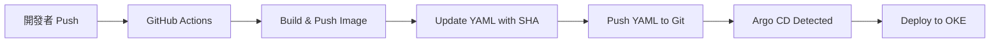

# 🤖 GitOps 實作指南 — Argo CD

本專案採用 **GitOps** 模式進行持續部署 (CD)，使用 Argo CD 作為 Kubernetes 內部的控制器，確保 OKE 叢集的狀態始終與 GitHub 倉庫中的 `k8s/` 配置保持一致。

## 1. 架構概述

我們將 CI 與 CD 職責分離：
- **CI (GitHub Actions)**：負責測試、構建 Multi-arch (amd64/arm64) Docker 映像檔，並推送到 OCI OCIR。
- **CD (Argo CD)**：偵測到 Git 上的 `k8s/` 目錄變更後，自動同步並更新 OKE 叢集中的資源。

## 2. Argo CD 安裝與配置 (OCI OKE)

### 2.1 安裝指令
由於 Argo CD 的資源較大，在 OKE 上需使用 Server-Side Apply：
```bash
kubectl create namespace argocd
kubectl apply --server-side -n argocd -f https://raw.githubusercontent.com/argoproj/argo-cd/stable/manifests/install.yaml
```

### 2.2 曝露 UI 面板 (HTTPS Ingress)
我們使用 Nginx Ingress 將 Argo CD 面板曝露於特定域名下：
*   **網址**：`https://argo.carrot-atelier.online`
*   **DNS 配置**：請新增 `A 紀錄` 指向 **`141.147.162.214`**。
*   **憑證同步**：由於 K8S 的 Secret 不能跨命名空間，我們需將 TLS 憑證從 `k8sdemo` 拷貝至 `argocd`：
    ```bash
    kubectl get secret wafer-bi-tls -n k8sdemo -o yaml | sed 's/namespace: k8sdemo/namespace: argocd/' | kubectl apply -f -
    ```

### 2.3 獲取管理員密碼
登入帳號為 `admin`，初始密碼獲取指令：
```bash
kubectl -n argocd get secret argocd-initial-admin-secret -o jsonpath="{.data.password}" | base64 -d; echo
```

## 3. Application 配置

我們在 Argo CD 中建立了一個名為 `wafer-bi` 的應用程式，其核心配置如下：

- **Repository**: `https://github.com/DarkSchneider1024/wafer-bi.git`
- **Path**: `k8s`
- **Cluster**: `https://kubernetes.default.svc`
- **Namespace**: `wafer-bi`
- **Sync Policy**: `Automated`
  - 勾選 `Prune Resources`：自動刪除 Git 中已移除的資源。
  - 勾選 `Self Heal`：防止手動在叢集中修改資源（確保 Git 為唯一真理）。

## 4. 進階：動態標籤與自動化 GitOps 流程

為了確保 OKE 叢集能 100% 同步到最新代碼，我們實作了「動態標籤 (Dynamic Tagging)」策略：

### 4.1 為什麼需要動態標籤？
如果 YAML 檔中永遠使用 `:latest`，Argo CD 會因為「檔案內容未變動」而不會觸發滾動更新。這會導致即使 Docker Registry 有新映像檔，Pod 依然跑著舊代碼。

### 4.2 運作邏輯
1.  **Unique Tag**: GitHub Actions 每次構建時，會產生一個基於 `GITHUB_SHA` 的唯一標籤。
2.  **Manifest Update**: 構建完成後，GitHub Actions 會自動修改 `k8s/` 目錄下的 Deployment YAML 檔案，將映像檔標籤從 `latest` 改為具體的 `Commit-SHA`。
3.  **Git Push Back**: GHA 將修改後的 YAML 推回 GitHub 倉庫。
4.  **Argo CD Sync**: Argo CD 偵測到 Git 內容變動，立即發動滾動更新 (Rolling Update)。

### 4.3 流程示意圖


透過此流程，我們實現了真正的「版本可追溯性」與「自動化部署閉環」。

## 6. 實戰採坑紀錄 (Troubleshooting)

### 6.1 GHA 權限不足 (403 Forbidden)
- **問題**：GitHub Actions 在嘗試推回更新後的 YAML 標籤時報錯 `Permission denied to github-actions[bot]`。
- **原因**：預設的 `GITHUB_TOKEN` 只有唯讀權限。
- **解法**：在 `deploy.yml` 中明確宣告 `permissions: contents: write`，並在倉庫設定中開啟寫入權限。

### 6.2 OKE 上的映像檔歧義 (ImagePullBackOff)
- **問題**：Deployment 顯示 `short name mode is enforcing`。
- **原因**：雲端環境不允許模糊的映像檔名稱。
- **解法**：永遠使用全限定名稱（FQIN），例如加上 `docker.io/` 前綴。

---

## 7. 平台部署與維護 SOP (Standard Operating Procedure)

即使擁有全自動化 CI/CD，維運團隊仍需遵循以下規範以確保系統穩定。

### 7.1 初次環境搭建 (Bootstrap)
1.  **OKE Setup**：建立叢集並獲取 `kubeconfig`。
2.  **Secret Injection**：將 OCI 認證、JWT Secret 手動寫入 K8S Secret 或 GitHub Secrets。
3.  **Argo CD Setup**：安裝 Argo CD 並將其 Ingress 導向 `argo.carrot-atelier.online`。

### 7.2 日常更新流程 (Standard Release)
1.  **開發者**：推送代碼至 `main` 分支。
2.  **監控 GHA**：觀察 [GitHub Actions](https://github.com/DarkSchneider1024/wafer-bi/actions) 是否成功完成 Build 與 Manifest Update。
3.  **驗證 Argo**：登入 [Argo CD](https://argo.carrot-atelier.online) 確認應用程式狀態為 `Synced` 且 `Healthy`。

### 7.3 緊急回滾流程 (Emergency Rollback)
1.  **Git Rollback**：直接在 Git 撤銷該次 Commit，CI/CD 會自動將叢集恢復至前一個穩定版本。
2.  **Argo Rollback**：若 Git 已毀損，可直接在 Argo CD 面板點擊 **History and Rollback** 選擇前一個成功版本進行覆蓋。

---
*Last updated: 2026-05-08*
