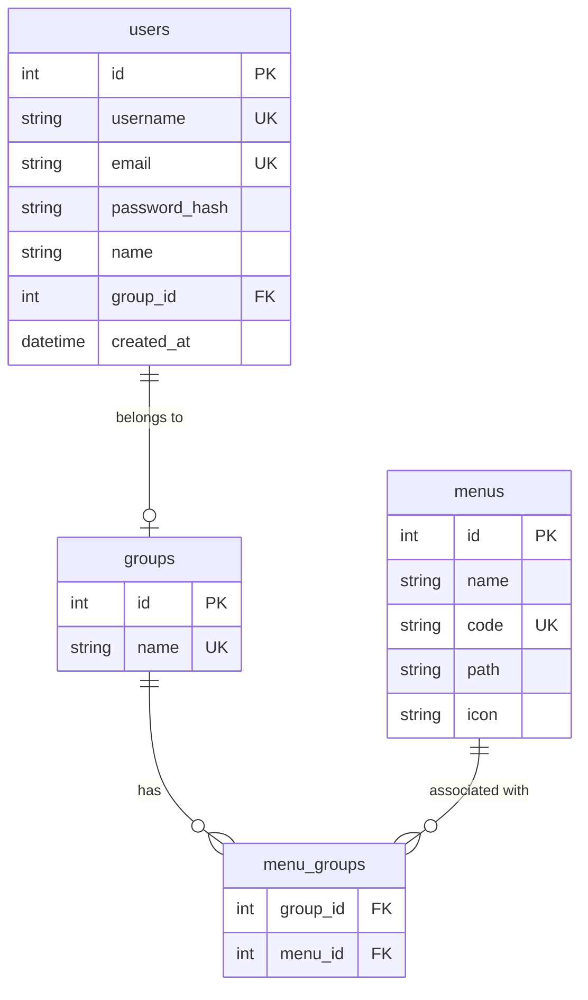

# 🗄️ Database Architecture & Schema 指南

本專案採用 **Polyglot Persistence (多語言持久化)** 策略，針對不同數據特性選擇最佳的存儲方案。

---

## 1. 關係型資料庫：PostgreSQL 16 (User Management)

*   **職責**: 存儲企業級身份數據、權限設定與業務配置。
*   **優勢**: 確保用戶註冊、修改權限時的數據具備 ACID 事務特性。

### A. 實體關係圖 (ERD)


### B. SQL DDL 腳本 (RBAC 擴充版)
以下是實現動態選單與權限控管的結構定義：

```sql
-- 1. 群組表
CREATE TABLE groups (
    id SERIAL PRIMARY KEY,
    name VARCHAR(255) UNIQUE NOT NULL
);

-- 2. 選單表
CREATE TABLE menus (
    id SERIAL PRIMARY KEY,
    name VARCHAR(255) NOT NULL,
    code VARCHAR(100) UNIQUE NOT NULL,
    path VARCHAR(255),
    icon VARCHAR(100)
);

-- 3. 選單-群組關聯表 (Many-to-Many)
CREATE TABLE menu_groups (
    group_id INTEGER REFERENCES groups(id) ON DELETE CASCADE,
    menu_id INTEGER REFERENCES menus(id) ON DELETE CASCADE,
    PRIMARY KEY (group_id, menu_id)
);

-- 4. 用戶表 (升級版)
CREATE TABLE users (
    id SERIAL PRIMARY KEY,
    username VARCHAR(255) UNIQUE NOT NULL,
    email VARCHAR(255) UNIQUE,
    password_hash VARCHAR(255) NOT NULL,
    name VARCHAR(255) NOT NULL,
    group_id INTEGER REFERENCES groups(id),
    created_at TIMESTAMP DEFAULT CURRENT_TIMESTAMP
);
```

---

## 2. 現代化數據湖：Delta Lake (Parquet 格式)

用於存放工業級的晶圓量測數據。

| 欄位名稱 | 型別 | 說明 |
| :--- | :--- | :--- |
| **lot_id** | String | 批次 ID (例如: Lot1) |
| **wafer_id** | String | 晶圓 ID (例如: W01) |
| **parameter** | String | 量測參數 (例如: Thickness) |
| **x** | Int | 座標 X |
| **y** | Int | 座標 Y |
| **value** | Float | 量測數值 |

### 為什麼選擇 Delta Lake 而非傳統 SQL 資料庫？
1.  **大數據吞吐量**: 傳統資料庫在處理數百萬行 Die 數據時效率較低。
2.  **開放格式**: Parquet 檔案可以被 Python、Spark 等多種工具直接讀取。
3.  **計算下推 (Push-down)**: 配合 DuckDB 或 PyArrow，實現極速掃描。

---

## 3. 數據流向圖 (Data Flow)

1.  **用戶操作** -> 由 **PostgreSQL** 驗證身分。
2.  **大數據查詢** -> 後端透過 `deltalake` 庫直接讀取 **Persistent Volume** 中的 Parquet 檔案。
3.  **分頁處理** -> 透過 Python 在記憶體中進行分頁處理，最後轉化為 JSON 回傳前端。

---
*本文件由 AI 協助整理，旨在說明 Wafer BI 系統中的數據管理策略。*
