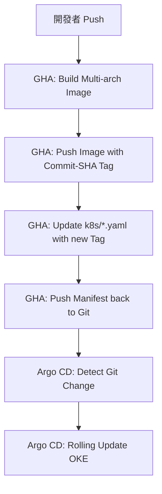

# 🚀 Wafer BI：終極部署與 CI/CD 維運全書

本手冊整合了 Oracle Cloud (OCI) 環境搭建、GitHub Actions 自動化構建與 Argo CD GitOps 維運流程，是維護「金色蘿蔔」平台的唯一指引。

---

## 1. 基礎環境初始化 (Bootstrap)

在開始任何自動化之前，必須手動完成以下基礎建設。

### 1.1 OKE 叢集與總機系統
1.  **建立 OKE 叢集**：使用 OCI 的 **Quick Create** 建立 Ampere (ARM) 節點叢集。
2.  **配置 Cloud Shell**：獲取 `kubeconfig`。
3.  **安裝 Nginx Ingress**：
    ```bash
    kubectl apply -f https://raw.githubusercontent.com/kubernetes/ingress-nginx/controller-v1.8.2/deploy/static/provider/cloud/deploy.yaml
    ```
4.  **安裝 Argo CD**：
    ```bash
    kubectl create namespace argocd
    kubectl apply --server-side -n argocd -f https://raw.githubusercontent.com/argoproj/argo-cd/stable/manifests/install.yaml
    ```

### 1.2 域名與 TLS 憑證
*   **域名**：`carrot-atelier.online` (使用 Cloudflare 或 OCI DNS 管理)。
*   **憑證同步**：將 `k8sdemo` 命名的 TLS 憑證拷貝至 `argocd` 命名空間。
    ```bash
    kubectl get secret wafer-bi-tls -n k8sdemo -o yaml | sed 's/namespace: k8sdemo/namespace: argocd/' | kubectl apply -f -
    ```

---

## 2. 自動化核心配置 (CI/CD Setup)

### 2.1 GitHub Secrets 指南
請在 GitHub 倉庫設定以下關鍵變數：

| 類別 | 參數名稱 | 說明 |
| :--- | :--- | :--- |
| **OCI 身分** | `OCI_USER_OCID`, `OCI_TENANCY_OCID`, `OCI_REGION` | 叢集存取權限。 |
| **API 密鑰** | `OCI_PRIVATE_KEY`, `OCI_FINGERPRINT` | 用於 GHA 登錄 OCI。 |
| **倉庫認證** | `OCI_USER_NAME`, `OCI_AUTH_TOKEN` | 用於推送到 OCIR (Docker Registry)。 |
| **系統密鑰** | `POSTGRES_PASSWORD`, `JWT_SECRET` | 應用程式運行所需。 |

### 2.2 權限採坑提醒 (CRITICAL)
- **GitHub Actions 權限**：必須在 `deploy.yml` 宣告 `permissions: contents: write`，否則 GHA 無法將標籤更新回填至 Git。
- **工作流權限設定**：在 GitHub 網頁端的 `Settings > Actions > General` 必須勾選 **"Read and write permissions"**。

---

## 3. GitOps 運作邏輯：動態標籤 (Dynamic Tagging)

我們採用了進階的 **「自動回填標籤」** 流程，徹底解決了 `:latest` 映像檔不更新的問題。

### 3.1 流程圖


---

## 4. 實戰維運與故障排除 (Ops Guide)

### 4.1 常用維運指令集 (常用急救包)
- **查看 Pod 崩潰原因**：`kubectl logs [POD_NAME] -n k8sdemo --previous`
- **強制重啟服務**：`kubectl rollout restart deployment/[NAME] -n k8sdemo`
- **進入資料庫重置帳密**：`kubectl exec -it deployment/postgres -n k8sdemo -- psql -U admin -d k8sdemo -c "DELETE FROM users;"`

### 4.2 常見錯誤排除 (FAQ)
- **ImagePullBackOff**：檢查 YAML 是否遺漏了 `docker.io/` 前綴。
- **CrashLoopBackOff (OTel)**：檢查 ConfigMap 是否使用了已廢棄的 `jaeger` exporter 語法（應改用 `debug`）。
- **Argo CD 沒更新**：檢查 Git 上的 YAML 是否真的被 GHA 更新了，或點擊 Argo 的 **"Hard Refresh"**。

---
*Last updated: 2026-05-08*
*Maintainer: Golden Carrot Architect*
