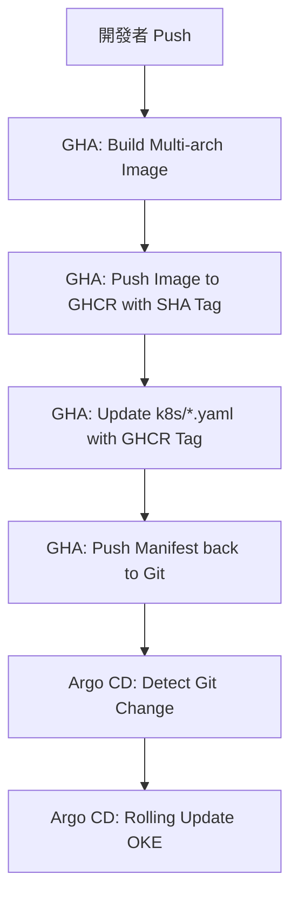

# 🚀 Wafer BI：終極部署與 CI/CD 維運全書

本手冊整合了 GitHub Container Registry (GHCR) 鏡像託管、GitHub Actions 自動化構建與 Argo CD GitOps 維運流程，是維護「金色蘿蔔」平台的唯一指引。

---

## 1. 鏡像託管架構 (Container Registry)

> [!IMPORTANT]
> **架構異動通知 (2026-05-10)**：
> 原 Oracle Cloud (OCI) OCIR 鏡像庫因免費試用期結束後會鎖定 API 存取，導致網站崩潰。目前已全面遷移至 **GitHub Container Registry (GHCR)**。

### 1.1 GHCR 規範與限制
- **小寫規範**：Docker 鏡像路徑必須全小寫。CI 工作流中已加入自動轉換邏輯（`DarkSchneider1024` -> `darkschneider1024`）。
- **權限與 Visibility**：
  - 新鏡像首次 Push 後預設為私有。
  - **手動操作**：必須進入 `Settings -> Packages` 將 `Visibility` 修改為 **Public**，否則 OKE 叢集將因無法通過認證而報 `ImagePullBackOff`。

---

## 2. 自動化核心配置 (CI/CD Setup)

### 2.1 GitHub 權限配置
在 `.github/workflows/deploy.yml` 中，必須確保具備以下權限：
```yaml
permissions:
  contents: write   # 允許回填標籤到 Git
  packages: write   # 允許推送到 GHCR
```

### 2.2 網絡安全標籤 (NetworkPolicy Requirement)
OKE 叢集內啟用了嚴格的 NetworkPolicy。所有的 Deployment 必須手動在 `template.metadata.labels` 中包含以下標籤，否則無法互相連線（例如 user-service 連不上 postgres）：
- `env: production`
- `managed-by: argocd`

---

## 3. GitOps 運作邏輯：動態標籤 (Dynamic Tagging)

我們採用了 **「自動回填標籤」** 流程，徹底解決了 `:latest` 映像檔不更新的問題。

### 3.1 流程圖


---

## 4. 實戰維運與故障排除 (Ops Guide)

### 4.1 常用維運指令集 (常用急救包)
- **手動回滾鏡像**：`kubectl set image deployment/[NAME] [NAME]=ghcr.io/darkschneider1024/[NAME]:[TAG] -n k8sdemo`
- **查看 Pod 標籤**：`kubectl get pods --show-labels -n k8sdemo`
- **手動補標籤 (急救)**：`kubectl label pod [POD_NAME] env=production managed-by=argocd -n k8sdemo`
- **查看鏡像拉取錯誤**：`kubectl describe pod [POD_NAME] -n k8sdemo`

### 4.2 常見錯誤排除 (FAQ)
- **ImagePullBackOff**：
  - 檢查 GitHub 鏡像是否已設為 **Public**。
  - 檢查鏡像路徑是否包含大寫字母（必須全小寫）。
- **Init:0/1 (Stuck)**：
  - 通常是 NetworkPolicy 擋住了對資料庫的連線。
  - 檢查 Pod 是否帶有 `env: production` 標籤（Source 與 Destination 都需要）。
- **OCI 403 Forbidden**：
  - 代表 OCI 免費額度已到期，請無視並改用 GitHub Actions + GHCR 流程。

---
*Last updated: 2026-05-11*
*Maintainer: Golden Carrot Architect (AI Enhanced)*
