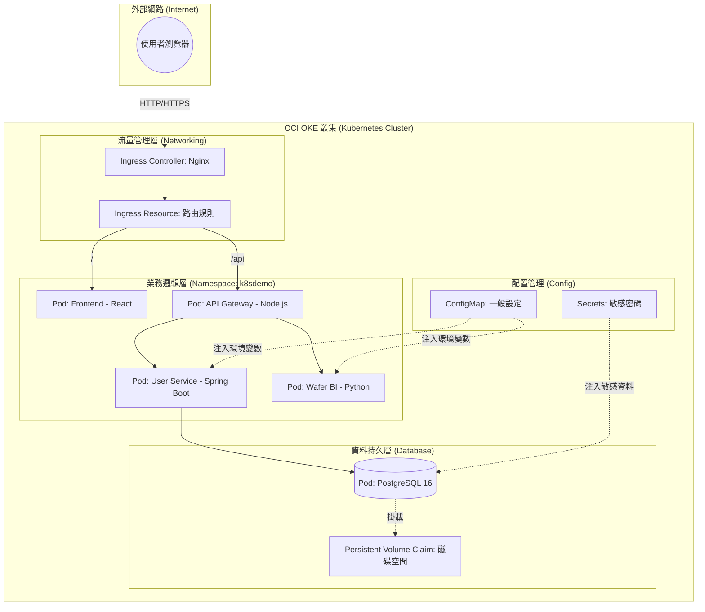

# 🎡 Kubernetes 系統架構與名詞詳解 (Wafer-BI 專案版)

這份文件旨在幫助你理解本專案在 K8S 中的運作邏輯。我們將系統比喻為一家**「大型自動化餐廳」**。

---

## 1. 系統架構圖 (Mermaid)



---

## 2. K8S 核心名詞：功能與職責

這裡我們用「餐廳」來對比 K8S 的專有名詞：

| K8S 名詞 | 餐廳比喻 | 在本專案中的職責 |
| :--- | :--- | :--- |
| **Node (節點)** | **店面實體** | 這是 OCI 提供的虛擬機 (如 Ampere ARM)，所有服務都跑在上面。 |
| **Namespace (命名空間)** | **不同部門** | 專案使用 `k8sdemo`。它像是一道圍牆，把不同專案的資源隔開，避免名字衝突。 |
| **Pod (容器組)** | **工作站 / 廚師** | K8S 的最小單位。例如一個 `Frontend Pod` 裡面跑著你的 React 網頁。**Pod 是會消失的**，壞了 K8S 會自動補一個新的。 |
| **Deployment (部署控制)** | **排班表** | 定義你要跑幾個 Pod。例如 `frontend` 設定 `replicas: 2`，K8S 就會確保永遠有 2 個前端在線上。 |
| **Service (服務入口)** | **內部分機號碼** | 因為 Pod 的 IP 會變，Service 提供一個固定的名稱（如 `postgres-service`）。後端只要撥這個號碼就能找到資料庫。 |
| **Ingress (總機/入口)** | **餐廳大門口** | 這是唯一的對外窗口。它根據網址路徑（`/` 或 `/api`）決定要把客人引導到前端還是後端。 |
| **ConfigMap (配置地圖)** | **菜單與公佈欄** | 存放不敏感的設定，如 `DB_NAME` 或 `API_URL`。修改這裡，Pod 就能讀到新設定。 |
| **Secret (秘密)** | **保險箱** | 存放敏感資料，如 `POSTGRES_PASSWORD`。它會加密存儲，只有授權的 Pod 才能讀取。 |
| **PVC (持久化磁碟)** | **倉庫/冰箱** | Pod 重啟後資料會消失，但資料庫需要存檔。PVC 就像是一個獨立的硬碟，即使 Pod 壞了，資料還是在硬碟裡。 |

---

## 3. 進階觀念：有網域 (Domain) vs 無網域 (IP) 的設定差異

在雲端部署時，從「用 IP 測試」過渡到「正式網域掛牌」，設定上會有巨大的改變：

### A. 流量進入點的差異
| 特性 | 僅使用 IP (開發期) | 使用網域 (生產期) |
| :--- | :--- | :--- |
| **存取方式** | `http://141.147.x.x` | `https://wafer.carrot-atelier.online` |
| **安全性** | 無加密 (HTTP) | **TLS 加密 (HTTPS)** |
| **路由規則** | 只能靠不同的 Port 號區分 (例如 :80, :3000) | 靠 **Ingress** 根據網址標籤自動分流 (Virtual Hosting) |
| **擴充性** | 一個 IP 難以對應多個網站 | 一個 IP 可以對應無限個子網域 |

### B. 為什麼需要「Port 對齊」？
在我們專案中，你可能會發現 Port 號從 `5173` 變成了 `80`。這是因為：
1. **開發環境 (`:5173`)**：Vite 預設開啟一個帶有熱更新功能的開發伺服器，適合邊寫邊看。
2. **生產環境 (`:80`)**：我們將程式碼編譯成靜態檔案後放入 **Nginx**。Nginx 是專業的伺服器，預設跑在 Port 80，效能更強、更穩定。
3. **路徑暢通**：Ingress 像是一條高速公路，它的出口（Service Port）必須跟你的家門口（Container Port）對齊，流量才進得去。

---

## 4. 觀念澄清：K8S 只有管理 Pod，沒有管理 Docker 嗎？

這是初學者最容易混淆的地方！簡單來說：**Pod 是 K8S 的「包裝盒」，而 Docker 容器是盒子裡的「內容物」。**

### 層級關係（由大到小）
1.  **Kubernetes (管理員)**：負責指揮，決定哪台機器要跑幾個包裝盒。
2.  **Pod (包裝盒)**：K8S 管理的**最小單位**。它是一組「共用網路和硬碟」的容器集合。
3.  **Container (內容物)**：真正跑程式碼的地方（例如 Docker 容器）。

### 為什麼不直接管理 Docker，要多一層 Pod？
*   **多容器協作 (Sidecar)**：一個 Pod 裡可以塞多個容器。例如：一個「主程式容器」配一個「日誌收集容器」，它們在 Pod 裡就像在同一台電腦上一樣，溝通極快。
*   **自我修復 (Self-healing)**：如果 Docker 容器崩潰了，K8S 會偵測到 **Pod** 異常，自動殺掉並重啟一個全新的 Pod。
*   **環境一致性**：Pod 為容器提供了統一的網路環境（所有容器共享同一個 `localhost`），這讓微服務開發變得簡單。

### 趣味比喻：網咖經營學
*   **Docker 映像檔** = **遊戲光碟**（裡面裝著程式）。
*   **Docker 容器** = **正在執行的遊戲**。
*   **Pod** = **網咖的電腦主機**（裡面跑著遊戲，還有耳機、鍵盤等配備）。
*   **Kubernetes** = **網咖老闆**（管理哪台主機要開給誰、哪台主機壞了要換新的）。

---

## 4. 專案中的數據流向 (一步步解析)

1.  **請求進入**：你輸入 IP，請求打到 **Ingress Controller**。
2.  **路由分配**：
    *   路徑是 `/` -> 交給 `frontend` Service -> 轉發給其中一個 **Frontend Pod**。
    *   路徑是 `/api` -> 交給 `api-gateway` Service -> 轉發給 **API Gateway Pod**。
3.  **微服務協作**：
    *   API Gateway 收到請求，判斷這是要找用戶資料還是晶圓數據。
    *   如果是用戶請求，它會呼叫 `user-service`。
4.  **資料存取**：
    *   `user-service` 向 `postgres-service` 發送 SQL 請求。
    *   **Postgres Pod** 從 **PVC (磁碟)** 讀取數據並回傳。
5.  **回傳結果**：資料一路原路返回，最後呈現出你在網頁上看到的圖表。

---

## 4. 給學習者的建議 (如何練習？)

如果你想深入學習，可以嘗試在 Cloud Shell 玩玩看：
- **看狀態**：`kubectl get all -n k8sdemo` (看所有資源)
- **看設定**：`kubectl get configmap app-config -o yaml` (看設定檔內容)
- **看日誌**：`kubectl logs -f [pod-name] -n k8sdemo` (追蹤廚師正在做什麼)
- **動手修**：嘗試刪掉一個 Pod `kubectl delete pod [pod-name]`，觀察 K8S 是不是真的會自動生出一個新的（Self-healing）。

---
## 5. 常用維運指令集 (Troubleshooting Cheat Sheet)

在實際維運 Wafer BI 平台時，以下指令是你最常使用的「急救包」：

### 5.1 狀態觀察 (Observability)
- **查看所有資源狀態**：
  ```bash
  kubectl get all -n k8sdemo
  ```
- **監控 Pod 動態 (持續更新)**：
  ```bash
  kubectl get pods -n k8sdemo -w
  ```
- **查看 Pod 詳細資訊 (排查 ImagePullBackOff 或 Pending)**：
  ```bash
  kubectl describe pod [POD_NAME] -n k8sdemo
  ```

### 5.2 故障排除 (Debugging)
- **查看即時日誌**：
  ```bash
  kubectl logs -f [POD_NAME] -n k8sdemo
  # e.g. kubectl logs -f user-service-56688dc449-4sxtf -n k8sdemo
  ```
- **查看「上一刻」崩潰的日誌 (排查 CrashLoopBackOff)**：
  ```bash
  kubectl logs [POD_NAME] -n k8sdemo --previous
  # e.g. kubectl logs otel-collector-664959bffd-pr2hk -n k8sdemo --previous
  ```
- **進入容器內部執行指令**：
  ```bash
  kubectl exec -it [POD_NAME] -n k8sdemo -- /bin/sh
  # e.g. kubectl exec -it api-gateway-7995b54ddd-q56qj -n k8sdemo -- /bin/sh
  ```

### 5.3 服務變更與重啟 (Management)
- **強制重啟服務 (讓 Pod 重新拉取設定或重啟)**：
  ```bash
  kubectl rollout restart deployment/[DEPLOYMENT_NAME] -n k8sdemo
  # e.g. kubectl rollout restart deployment/user-service -n k8sdemo
  ```
- **手動更新映像檔版本 (解決 ImagePullBackOff)**：
  ```bash
  kubectl set image deployment/[DEPLOYMENT_NAME] [CONTAINER_NAME]=[IMAGE_PATH] -n k8sdemo
  # e.g. kubectl set image deployment/jaeger jaeger=docker.io/jaegertracing/all-in-one:1.60.0 -n k8sdemo
  ```
- **手動進入資料庫清理數據 (例如重置 MD5 舊密碼)**：
  ```bash
  kubectl exec -it deployment/postgres -n k8sdemo -- psql -U admin -d k8sdemo -c "DELETE FROM users;"
  ```

---
