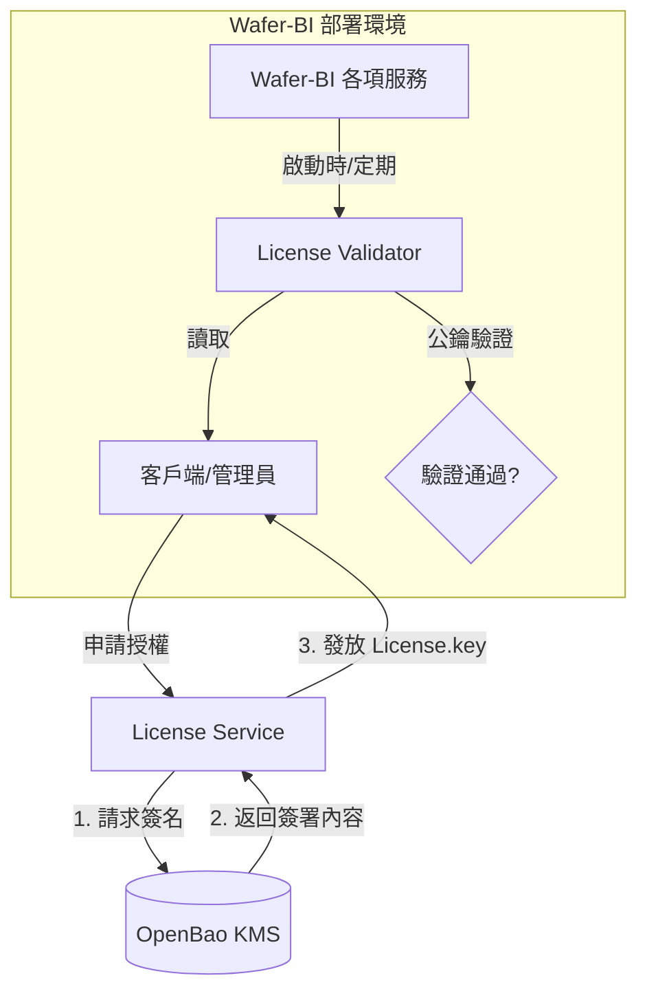

# License Server 與 KMS 導入評估報告

## 1. 專案背景與需求
Wafer-BI 專案目前採用微服務架構（Java/Python/Node.js），需要一套安全、可靠且具備擴展性的 License 管理機制，用以控制商業版功能授權、有效期管理以及硬體綁定。

根據提供的參考資料，核心需求在於建立一個基於 **KMS (Key Management Service)** 的金鑰管理架構，確保授權簽章的金鑰安全性。

## 2. 參考架構分析

### 方案 A：HashiCorp Vault (KMS 核心)
- **原理**：利用 Vault 的 **Transit Secrets Engine**。金鑰存儲在 Vault 中且不可導出，應用程式僅能透過 API 請求 Vault 進行「簽名 (Sign)」操作。
- **優點**：
    - 極高的安全性：私鑰不落地，減少金鑰洩露風險。
    - 豐富的生態系：支援多種認證方式（AppRole, Kubernetes auth）。
    - 完整審計日誌 (Audit Log)。
- **缺點**：授權變更為 BSL，對於部分商業用途可能存在法律考量。

### 方案 B：OpenBao (開源社群分支)
- **原理**：OpenBao 是 Vault 在變更授權前 (v1.14) 的開源分支，由 Linux Foundation 維護，保持 MPLv2 協議。
- **優點**：完全開源，API 與 Vault 高度相容，適合作為長期穩定的基礎設施。
- **評估**：針對 Wafer-BI 專案，**OpenBao 是目前最推薦的選擇**，既保留了 Vault 的強大功能，又無授權爭議。

---

## 3. 適用於 Wafer-BI 的架構設計

建議導入一個獨立的 `license-service`，並配合 `OpenBao` 作為金鑰管理中心。

### 3.1 系統架構圖 (Mermaid)

### 3.2 關鍵技術組件
1.  **KMS 層 (OpenBao)**：
    - 啟動 **Transit Engine**。
    - 建立一對非對稱金鑰 (RSA-4096 或 ED25519) 用於 License 簽署。
2.  **生成層 (License Service)**：
    - 負責處理客戶資訊、機器碼 (Machine ID)、到期日。
    - 將資訊打包成 JSON/JWT。
    - 調用 OpenBao API 進行雜湊簽名。
3.  **驗證層 (SDK/Validator Library)**：
    - 整合於 `user-service` 或 `api-gateway`。
    - 內嵌或動態獲取公鑰 (Public Key)，僅進行驗證，不需存取 KMS。

---

## 4. 實施評估

### 4.1 對現有架構的影響
- **Infrastructure**：需在 `docker-compose.yml` 中新增 `openbao` 容器。
- **Security**：將目前寫在環境變數中的 `JWT_SECRET`、`OPENAI_API_KEY` 等敏感資訊一併移入 OpenBao 管理，大幅提升系統安全性。
- **Development**：開發者需學習 OpenBao 的 API 呼叫與政策 (Policy) 設定。

### 4.2 優缺點對比

| 維度 | OpenBao + License Service (推薦) | 傳統資料庫 + 固定金鑰 (不推薦) |
| :--- | :--- | :--- |
| **安全性** | 高（私鑰不離開 KMS） | 低（私鑰易在代碼或配置中洩漏） |
| **合規性** | 符合業界安全標準 (SOC2/ISO27001) | 較差 |
| **維護成本** | 中（需維護一個新服務） | 低 |
| **靈活性** | 高（支援多種加密演算法） | 低 |

---

## 5. 具體導入建議步驟

1.  **環境搭建**：
    - 在 `docker-compose.yml` 中部署 `openbao` 伺服器並進行初始化 (Unseal)。
2.  **KMS 配置**：
    - 啟用 Transit Engine：`vault secrets enable transit`
    - 建立簽名金鑰：`vault write -f transit/keys/license-key type=rsa-4096`
3.  **開發 License-Service**：
    - 使用 Java 或 Python 撰寫一個輕量服務。
    - 串接 OpenBao SDK。
4.  **現有服務整合**：
    - 在 `user-service` 加入授權校驗過濾器 (Filter)。
    - 若校驗失敗，限制 AI Assistant 或報表導出功能。

---
**評估結論**：建議採用 **OpenBao** 作為基礎架構，這不僅能解決 License 簽核的安全問題，更能為 Wafer-BI 提供完善的機密管理 (Secrets Management) 能力，符合企業級 BI 產品的定位。
