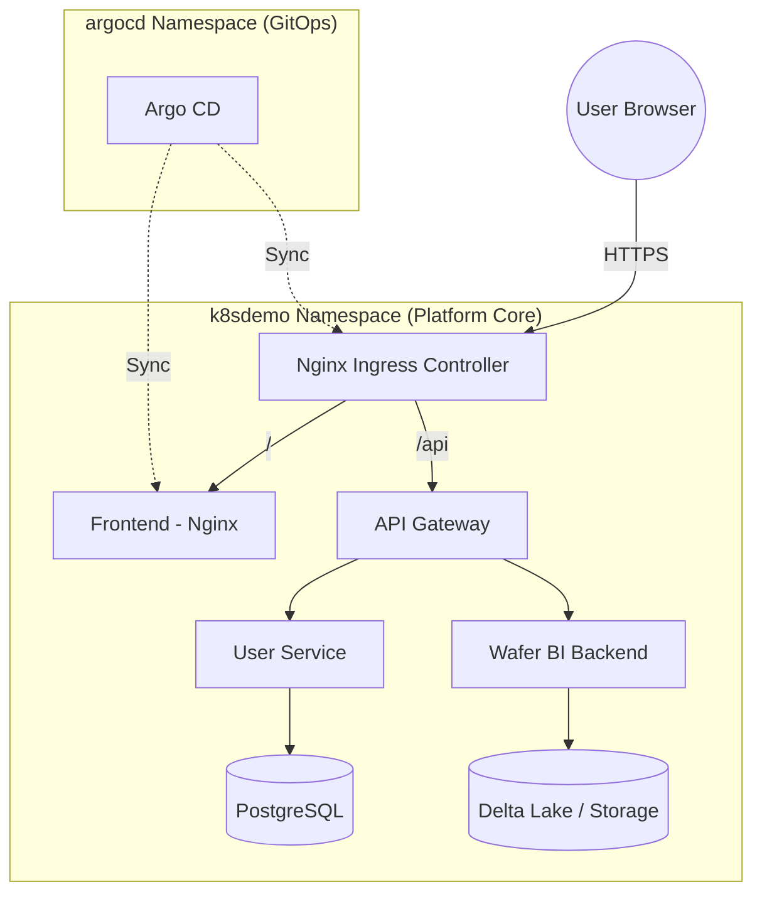
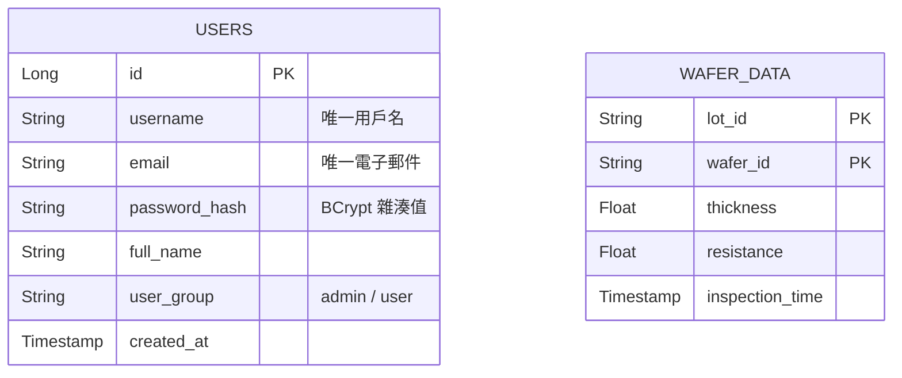

# 📖 Wafer BI 系統架構文件 (Comprehensive System Architecture)

## 1. 系統概述

本專案是一個**整合式企業微服務生態系統**，部署在 Kubernetes 上。它展示了 K8S 如何編排不同類型的業務負載：
1. **用戶管理系統 (Identity)**：基於 Java Spring Boot 的企業級身份驗證服務，整合 Liquibase 版本控制。
2. **Wafer BI 分析平台 (Data)**：處理工業級晶圓數據，展示 Delta Lake 與高效能分析 API，前端採用 Nginx 生產級部署。

## 2. 技術選型

| 技術 | 選擇 | 理由 |
|------|------|------|
| **Frontend** | React + **Nginx** | 多階段構建，Nginx 託管靜態檔案，效能最優且穩定 |
| **API Gateway** | Node.js (Express) | 輕量、流量轉發與跨域處理 |
| **User Service** | Java (Spring Boot 3) | 企業級架構，使用 **Liquibase** 管理資料庫版本 |
| **Wafer BI** | Python (FastAPI) | 適合數據處理，自動生成測試數據並讀取 Delta Lake |
| **Traffic** | **Ingress + TLS** | 支援 HTTPS 加密，整合 **Cert-Manager** 管理憑證 |
| **CI/CD** | GitHub Actions + **Argo CD** | GitHub 處理建置 (CI)，Argo CD 負責 GitOps 部署 (CD) |

---

## 3. 架構設計

### 3.1 整體流量圖 (Mermaid)


### 3.2 Kubernetes 資源說明
- **命名空間 (Namespace)**: 所有業務邏輯與數據分析服務皆統一集中在 `k8sdemo`，實現統一管理。
- **HTTPS 安全性**: 透過 `cert-manager` 實現全站傳輸加密。
- **跨平台相容**: 所有映像檔均支援 `amd64` 與 `arm64` 架構。

---

## 4. GitHub Secrets 與配置管理

### 4.1 OCI 基礎設施相關
| Secret Name | 說明 |
|-------------|------|
| `OCI_REGION` | OCI 區域 (如 `ap-tokyo-1`) |
| `OCI_TENANCY_NAMESPACE` | OCIR 命名空間 |
| `OCI_USER_NAME` | OCI 用戶名 |
| `OCI_AUTH_TOKEN` | OCI 驗證權杖 |
| `OCI_PRIVATE_KEY` | OCI API 私鑰 |
| `OKE_CLUSTER_ID` | OKE 叢集 OCID |

### 4.2 應用程式機密 (由 CICD 注入 K8S Secret)
| Secret Name | 說明 | 預設值 (演示用) |
|-------------|------|-----------------|
| `POSTGRES_USER` | 資料庫管理員帳號 | `admin` |
| `POSTGRES_PASSWORD` | 資料庫管理員密碼 | `postgres_password_123` |
| `JWT_SECRET` | JWT 簽名金鑰 | `super_secret_jwt_key_2024` |

### 4.3 演示用帳號 (Default Demo Accounts)
| 帳號 | 密碼 | 初始群組 | 說明 |
|-------|------|----------|------|
| `admin` | `admin` | `admin` | 系統管理員 (使用 **BCrypt** 強雜湊加密) |
| `demo01` | `demo01_password_123` | `user` | 演示專用帳號 |

---

## 5. 資料庫實體關係圖 (ER Diagram)

本系統使用 **PostgreSQL**，並透過 **Liquibase** 進行 Schema 版本管控。



---

## 5. 網路架構與埠號對照 (Networking & Ports)

### 5.1 環境對照表

| 服務項目 | 本地開發 (Local) | 伺服器生產環境 (OKE) | 說明 |
| :--- | :--- | :--- | :--- |
| **前端入口 (URL)** | `http://localhost:5173` | `https://wafer.carrot-atelier.online` | 生產環境透過 Ingress 反向代理 |
| **API 網關 (Gateway)** | `http://localhost:8080` | K8S 內部轉發 (`port: 8080`) | 生產環境不對外暴露此埠號 |
| **User Service** | `http://localhost:3002` | K8S 內部通訊 (`port: 3002`) | - |
| **Wafer BI Service** | `http://localhost:8000` | K8S 內部通訊 (`port: 8000`) | - |
| **資料庫 (Postgres)** | `localhost:5432` | K8S 內部通訊 (`port: 5432`) | - |

### 5.2 通訊邏輯差異
- **本地端 (Development)**: 前端 Vite 透過 `server.proxy` 將 `/api` 請求代理至 `localhost:8080`。
- **伺服器端 (Production)**: 統一經由 **Port 443 (HTTPS)** 進入，內部透過 K8S Service Name 進行 DNS 通訊。

---

## 6. 相關文件索引
*   **📘 業務功能手冊 (Function Book)**
    *   [🗺️ 用戶角色與權限](./function-book/auth-roles.md)
    *   [🔬 Wafer BI 分析功能](./function-book/wafer-bi-analysis.md)
*   **⚙️ 技術架構規範 (Function Tech)**
    *   [🔐 認證與安全性技術](./function-tech/jwt-security.md)
    *   [🏗️ 數據流與追蹤架構](./function-tech/data-flow-arch.md)
*   **🎡 其他參考**
    *   [K8S 核心名詞與架構詳解](./k8s-arch-guide.md)
    *   [🤖 GitOps 與 部署維運 SOP](./deployment-sop.md)

---

## 7. 分佈式追蹤 (Distributed Tracing)

為了監控微服務之間的請求鏈結，系統預留了追蹤接口，並計畫導入 **OpenTelemetry (OTel)** 標準。

### 7.1 現有實現：Trace ID 傳播
目前 API Gateway 已實作基礎的 Trace ID 生成與傳播機制：
*   **生成器**：API Gateway (Node.js) 會為每個進入系統的請求生成一個唯一的 `X-Trace-Id`。
*   **傳播方式**：透過 HTTP Header 將 ID 傳遞給下游的 `User Service` 與 `Wafer BI Service`。
*   **目的**：當日誌出現錯誤時，可透過同一個 Trace ID 串聯起 Gateway、Java 與 Python 的所有相關日誌。

### 7.2 全面實作：OpenTelemetry + Jaeger
系統已全面升級至標準的 OpenTelemetry 追蹤體系：
1.  **Collector**：已在 K8S 部署 OTel Collector (`otel-collector-service`)。
2.  **Visualization**：使用 **Jaeger** 進行視覺化分析，入口位址：`/jaeger`。
3.  **各端實作細節**：
    *   **Java**：透過 `opentelemetry-javaagent.jar` 實現零侵入追蹤。
    *   **Node.js**：透過 `tracing.js` 整合 `sdk-node` 實現全自動追蹤。
    *   **Python**：透過 `FastAPIInstrumentor` 攔截分析請求。

### 7.3 使用指南 (Usage Guide)

#### 1. 部署追蹤組件
若您是首次使用，請確保已在 K8S 叢集執行以下指令：
```bash
kubectl apply -f k8s/observability/
kubectl apply -f k8s/ingress.yaml
```

#### 2. 存取視覺化介面
打開瀏覽器訪問：`https://wafer.carrot-atelier.online/jaeger`
*   **Service** 下拉選單中可以選擇 `api-gateway`, `user-service` 或 `wafer-bi-service`。
*   點擊 **Find Traces** 即可看到所有流經系統的請求鏈結。

#### 3. 如何進行問題排查？
1.  **獲取 Trace ID**：在瀏覽器開發者工具 (F12) 的 **Network** 標籤中，點擊任何一個 `/api` 請求，查看 **Response Headers**，您會看到一個 `X-Trace-Id`。
2.  **精確搜尋**：將該 ID 複製，貼到 Jaeger 左側選單的 **"Lookup by TraceID"** 方塊中。
3.  **分析效能瓶頸**：您可以清楚看到請求在各個微服務停留的時間（例如：是 Java 資料庫查詢太慢，還是 Python 運算太久）。

---

## 8. 系統全網址導航地圖 (System URL Master List)

當系統發生異常時，請依照此地圖檢查各組件。所有子網址皆掛載於 `wafer.carrot-atelier.online` 之下。

### 8.1 應用程式與管理面板 (UI)
| 名稱 | 存取網址 | 說明 |
| :--- | :--- | :--- |
| **Wafer BI 前端** | `https://wafer.carrot-atelier.online/` | 主分析介面 |
| **系統狀態面板** | [UI 內部切換] | 登入管理員後於側邊欄點擊「系統狀態」 |
| **Argo CD 控制台** | `https://argo.carrot-atelier.online` | GitOps 自動化部署管理 (TLS 加密) |
| **Jaeger UI** | `https://wafer.carrot-atelier.online/jaeger` | 分佈式追蹤與效能分析 |

### 8.2 API 與開發者工具 (Backend & Debug)
| 類別 | 端點路徑 (URL) | 功能描述 |
| :--- | :--- | :--- |
| **系統資訊** | `https://wafer.carrot-atelier.online/api/system/info` | 查看全系統版本與相容性 JSON |
| **連通性測試** | `https://wafer.carrot-atelier.online/api/test-gateway` | 驗證網關路由與轉發路徑 |
| **Prometheus** | `https://wafer.carrot-atelier.online/api/metrics` | 網關層級的流量監控指標 |
| **數據 Meta** | `https://wafer.carrot-atelier.online/api/meta` | 測試 Python 後端連通性 (應回傳產品與批次列表) |

### 8.3 基礎設施健康檢查 (Health Checks)
| 服務組件 | 健康檢查網址 | 預期結果 |
| :--- | :--- | :--- |
| **API Gateway** | `https://wafer.carrot-atelier.online/api/healthz` | `{"status": "UP"}` |
| **User Service** | `https://wafer.carrot-atelier.online/api/auth/readyz` | 驗證 Java 後端就緒狀態 |
| **BI Backend** | `https://wafer.carrot-atelier.online/api/readyz` | 驗證 Python FastAPI 就緒狀態 |

### 8.4 底層基礎設施 IP (Emergency Access)
> [!CAUTION]
> 僅在 DNS 故障或 Ingress 失效時使用。

- **Argo CD 直接入口**: `https://151.145.77.41`
- **Frontend 直接入口**: `http://161.33.136.81`
- **Nginx Ingress IP**: `141.147.162.214`

---

## 9. HTTP 錯誤代碼與故障場景對照表

| **401** | Unauthorized | 1. Token 缺失或無效。<br>2. Token 已過期。 | 清除瀏覽器緩存，重新登入獲取新 Token。 |
| **403** | Forbidden | 1. 用戶群組 (Group) 權限不足。<br>2. 跨站請求被安全策略攔截。 | 檢查 JWT Payload 中的 `group` 欄位是否符合權限要求。 |

---
*最後更新：2026-05-07*

