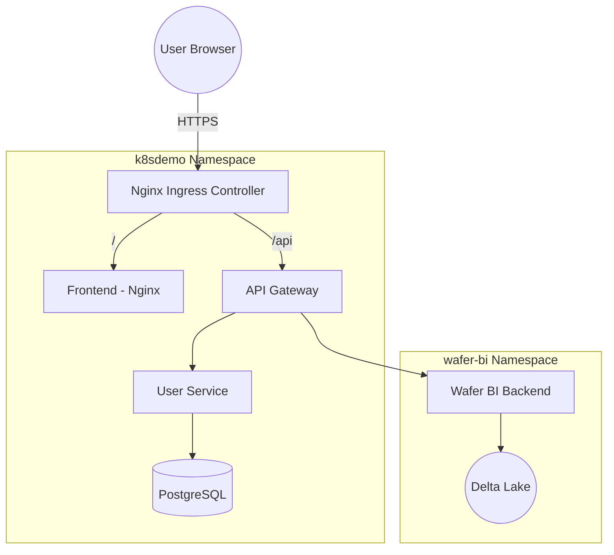

# 📖 K8S Microservices Demo — 系統架構文件

## 1. 系統概述

本專案是一個**整合式企業微服務生態系統**，部署在 Kubernetes 上。它展示了 K8S 如何編排不同類型的業務負載：
1. **用戶管理系統 (Identity)**：基於 Java Spring Boot 的企業級身份驗證服務，整合 Liquibase 版本控制。
2. **Wafer BI 分析平台 (Data)**：處理工業級晶圓數據，展示 Delta Lake 與高效能分析 API，前端採用 Nginx 生產級部署。

## 2. 技術選型 (更新版)

| 技術 | 選擇 | 理由 |
|------|------|------|
| **Frontend** | React + **Nginx** | 多階段構建，Nginx 託管靜態檔案，效能最優且穩定 |
| **API Gateway** | Node.js (Express) | 輕量、流量轉發與跨域處理 |
| **User Service** | Java (Spring Boot 3) | 企業級架構，使用 **Liquibase** 管理資料庫版本 |
| **Wafer BI** | Python (FastAPI) | 適合數據處理，自動生成測試數據並讀取 Delta Lake |
| **Traffic** | **Ingress + TLS** | 支援 HTTPS 加密，整合 **Cert-Manager** 管理憑證 |
| **CI/CD** | GitHub Actions + **Argo CD** | GitHub 處理建置 (CI)，Argo CD 負責 GitOps 部署 (CD) |
| **Storage** | Delta Lake (Parquet) | 存儲工業大數據，支持版本回溯與高效查詢 |

---

## 4. GitHub Secrets 配置

為了支持自動化部署與安全管理，必須在 GitHub 倉庫中設定以下 Secrets：

### 4.1 OCI 基礎設施相關
| Secret Name | 說明 |
|-------------|------|
| `OCI_REGION` | OCI 區域 (如 `ap-tokyo-1`) |
| `OCI_TENANCY_NAMESPACE` | OCIR 命名空間 |
| `OCI_USER_NAME` | OCI 用戶名 |
| `OCI_AUTH_TOKEN` | OCI 驗證權杖 (用於 Login OCIR) |
| `OCI_PRIVATE_KEY` | OCI API 私鑰 |
| `OKE_CLUSTER_ID` | OKE 叢集 OCID |

### 4.2 應用程式機密 (由 CICD 注入 K8S Secret)
| Secret Name | 說明 | 預設值 (演示用) |
|-------------|------|-----------------|
| `POSTGRES_USER` | 資料庫管理員帳號 | `admin` |
| `POSTGRES_PASSWORD` | 資料庫管理員密碼 | `postgres_password_123` |
| `JWT_SECRET` | JWT 簽名金鑰 | `super_secret_jwt_key_2024` |

---

## 5. 相關文件索引
- [🎡 K8S 核心名詞與架構詳解](./k8s-arch-guide.md) (推薦新手閱讀)
- [🤖 GitOps 與 Argo CD 實作](./cicd-argo.md)
- [🔐 安全性與 Sealed Secrets](./security-secrets.md)
- [🗄️ 資料庫 Schema 與 Liquibase 指南](./database-architecture.md)
- [🚀 Oracle Cloud (OCI) 部署指南](./oci-deployment.md)
- [📝 面試應對指南](./interview-guide.md)

---

## 3. 架構設計

### 整體流量圖

## 4. Kubernetes 資源說明

### 命名空間 (Namespace)
- `k8sdemo`: 核心展示區，包含網頁前端、API Gateway、用戶服務與資料庫。
- `wafer-bi`: 數據分析區，專門處理大數據相關的 BI 負載。

### 核心特性
- **HTTPS 安全性**: 透過 `cert-manager` 與 `oci-tls-secret` 實現全站傳輸加密。
- **資料庫遷移**: `user-service` 啟動時會透過 **Liquibase** 自動同步表格結構，無需手動執行 SQL。
- **跨平台相容**: 所有映像檔均支援 `amd64` 與 `arm64` 架構，可運行於 OCI 的 Intel 或 Ampere 節點。
- **數據自修復**: `wafer-bi` 具備自動數據生成功能，確保系統在任何情況下都有展示數據。

## 5. 部署與開發
- **生產環境**: 透過 GitHub Actions 自動化部署，詳見 [OCI 部署文件](./oci-deployment.md)。
- **架構原理**: 關於 Pod、Service 與 Docker 的層級關係，請參考 [K8S 學習指南](./k8s-arch-guide.md)。

---
*本文件旨在說明 Wafer BI 系統的最新技術現況與維運標準。*
