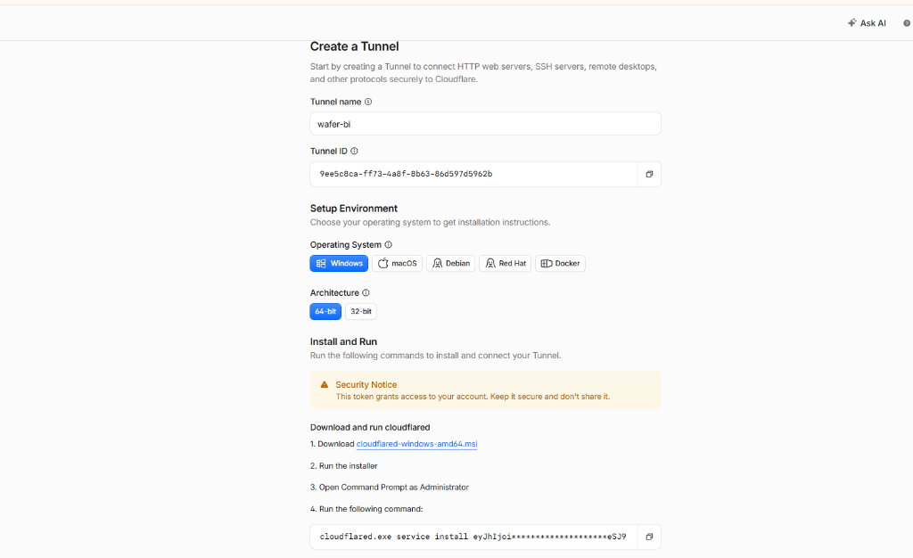
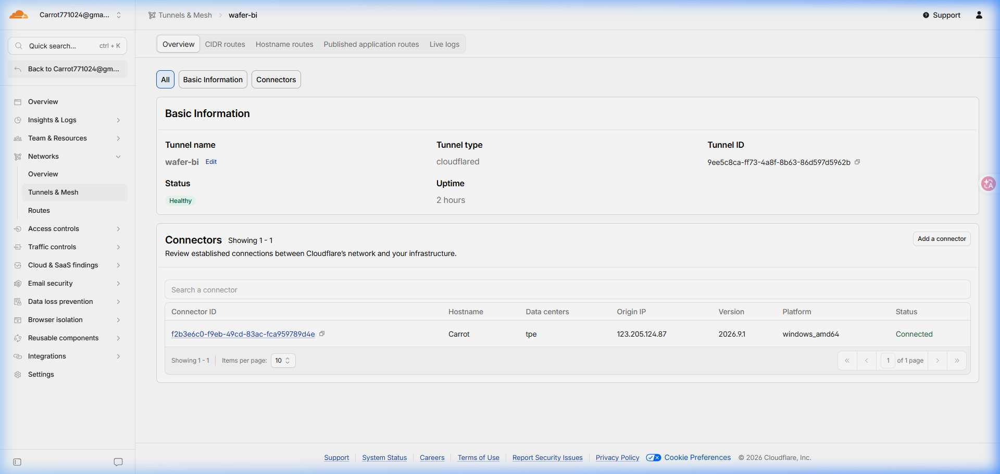
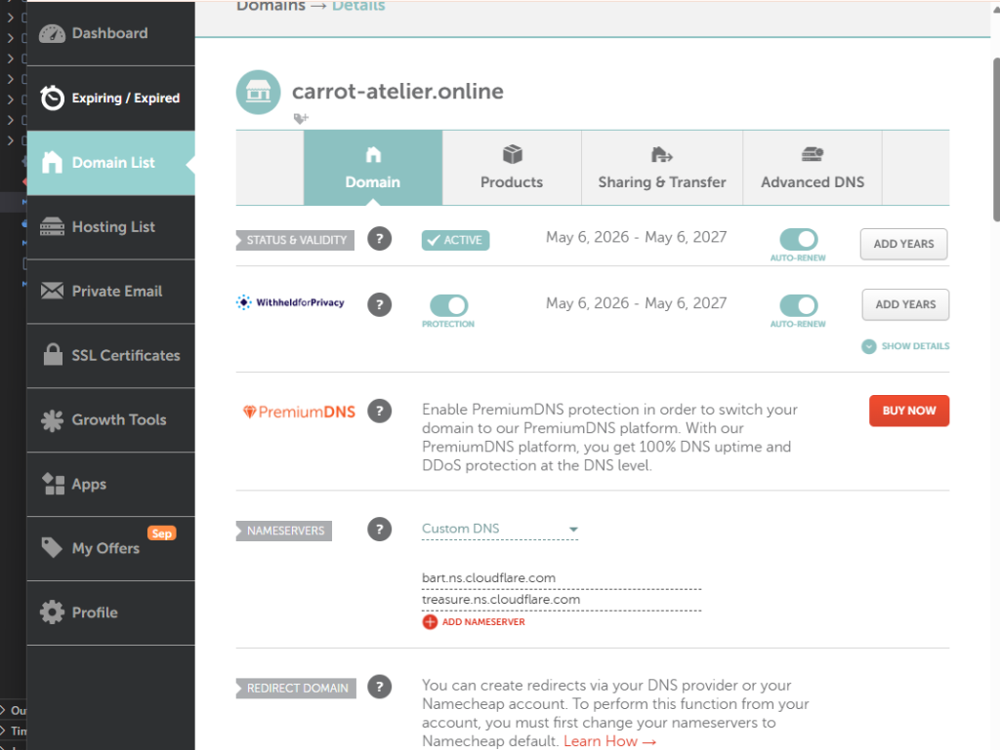
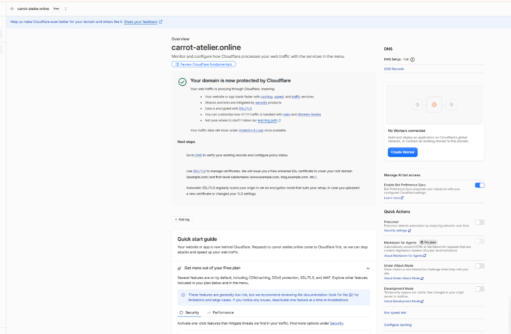
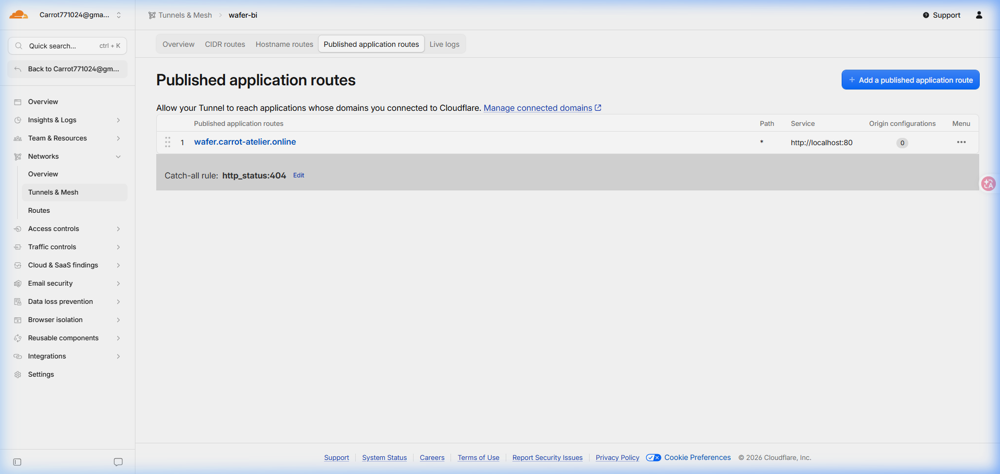
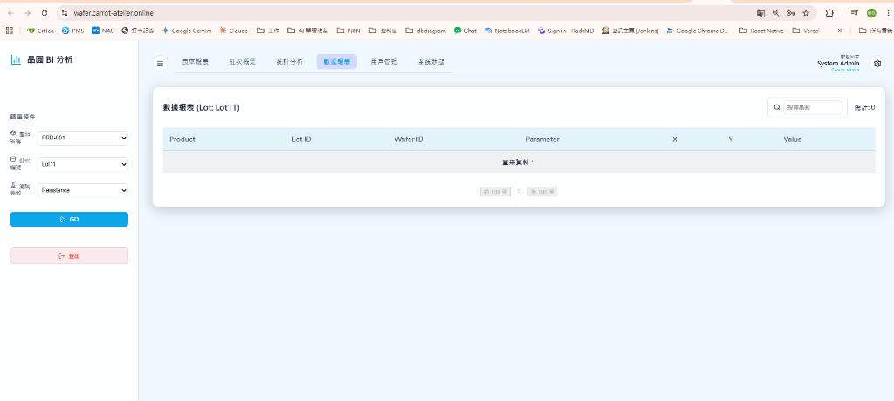

# Day 31: 番外篇：不用公網 IP，透過 Cloudflare Tunnel 將本地 K8S 發布到外網

*把留在本機的整套微服務，安全穿透到公網展示。*

### 1. 為什麼需要本地外網穿透

在 Day 9 與 Day 30 提過，因為雲端免費規格有限，這系列的實作都在本機 Docker Desktop K8S 運行。

本機運行雖然省下雲端成本，但有幾個限制：
- 無法直接提供 localhost 連結給他人測試
- 手機或其他外網裝置連不進來
- 無法驗證真實網域下的 HTTPS 與外部 Webhook

若要在一般家用網路對外暴露服務，通常需要固定 IP、設定路由器 Port Forwarding 與處理動態 DNS，同時還得把實體 IP 暴露給公網。

改用 Cloudflare Tunnel（Zero Trust）走的是出站加密連線（Outbound Tunnel）：本機向 Cloudflare Edge 建立通道，外部訪客訪問 Cloudflare CDN，流量經由通道轉發進本機，不需要公網 IP，也不用在路由器開放通訊埠。

### 2. 流量架構與鏈路

流量流轉路徑如下：

```text
[訪客瀏覽器]
       │
       ▼ (HTTPS: wafer.carrot-atelier.online)
[Cloudflare Edge CDN] (處理 SSL 終結與 DDoS 防護)
       │
       │ (Cloudflare Tunnel 加密通道)
       ▼
[Windows 本機 cloudflared 服務]
       │
       ▼ (HTTP: localhost:80)
[Ingress Controller (ingress-nginx)]
       │
       ├─► / ─────► wafer-frontend-svc:80 (React 前端)
       └─► /api/* ─► api-gateway-service:8080 (API Gateway)
                        └──► wafer-backend-svc:8000 (FastAPI 後端)
```

### 3. 部署實作步驟

#### 步驟 1：安裝本地 Ingress Controller

由 K8S Ingress Controller 監聽本機的 80 port，統一做路徑分流：

```bash
helm repo add ingress-nginx https://kubernetes.github.io/ingress-nginx
helm repo update
helm upgrade --install ingress-nginx ingress-nginx/ingress-nginx \
  --namespace ingress-nginx --create-namespace
```

在 Docker Desktop 上，`ingress-nginx-controller` 服務為 `LoadBalancer` 類型，會自動把容器內的 80/443 映射至 Windows 的 `localhost:80` 與 `localhost:443`。

#### 步驟 2：在 Cloudflare Zero Trust 建立 Tunnel

1. 登入 Cloudflare Dashboard，進入 Networks -> Tunnels。
2. 點擊 Create a Tunnel，選擇 Cloudflared，命名為 wafer-bi。
3. 取得安裝指令中的 Token（一長串英數字符號的 Token 字串）。



*▲ Cloudflare Tunnel 建立頁面：選擇作業系統架構並取得安裝指令與 Token*

4. 以系統管理員身分開啟 PowerShell，將 `cloudflared` 安裝為 Windows 常駐服務：

```powershell
cloudflared.exe service install <YOUR_TUNNEL_TOKEN>
```

安裝完成後，Windows 會自動啟動該服務，Cloudflare 後台的 Tunnel 狀態會轉為綠色的 HEALTHY：



*▲ Tunnel Overview 狀態頁：Tunnel 處於 Healthy 狀態，成功連線至台北（tpe）邊緣節點*

#### 步驟 3：設定網域託管與路由發布

若網域尚未託管至 Cloudflare，需先至網域註冊商（如 Namecheap）將 Nameservers 指向 Cloudflare：



*▲ Namecheap 後台：將 Nameservers 設為 Custom DNS 並填入 Cloudflare 指派的名稱伺服器*

DNS 轉移生效後，Cloudflare 儀表板會確認網域狀態：



*▲ Cloudflare 網域概覽頁：網域轉移完成，正式受 Cloudflare 防護*

接著在 Cloudflare Tunnel 的 Published application routes 標籤頁新增路由：
- **Subdomain**：`wafer`
- **Domain**：`carrot-atelier.online`
- **Path**：留空
- **Service Type**：`HTTP`
- **URL**：`localhost:80`

儲存後，Cloudflare 會自動建立 CNAME 記錄，將 `wafer.carrot-atelier.online` 的訪問請求透過 Tunnel 導向本機的 80 連接埠：



*▲ Published Application Routes 設定：將 wafer.carrot-atelier.online 流量導向本機 localhost:80*

### 4. 實戰踩坑與排查記錄

串接過程踩到三個問題，依序排查與修正：

#### 坑一：缺少 CRD 導致 Helm 安裝被拒

專案原本的 `helm/wafer-bi/templates/cluster-issuer.yaml` 定義了 `cert-manager.io/v1` 的 `ClusterIssuer` 資源。

在 OKE 雲端環境上有安裝 cert-manager，但在本地開發用叢集並沒有安裝。執行 `helm upgrade` 時，Kubernetes API Server 直接報錯拒絕安裝：

```text
Error: unable to continue with install: no matches for kind "ClusterIssuer" in version "cert-manager.io/v1"
```

**解法**：
修改 `cluster-issuer.yaml`，利用 Helm 的內建能力偵測叢集是否支援該 API 版本，只有在具備該 CRD 時才渲染：

```yaml
{{- if and .Values.ingress.enabled (.Capabilities.APIVersions.Has "cert-manager.io/v1") }}
apiVersion: cert-manager.io/v1
kind: ClusterIssuer
...
{{- end }}
```

這樣同一份 Helm Chart 就能兼顧本地純 Ingress 環境與雲端 cert-manager 環境。

#### 坑二：SSL 重定向造成的無窮迴圈 (308 Permanent Redirect)

安裝完 Ingress 並打通網址後，在瀏覽器打開網頁卻顯示連線錯誤。用 `curl` 檢視發現回傳了 308 重定向：

```bash
curl.exe -s -H "Host: wafer.carrot-atelier.online" http://localhost:80
# 回傳：<title>308 Permanent Redirect</title>
```

**原因**：
`templates/ingress.yaml` 原本設定了 `nginx.ingress.kubernetes.io/ssl-redirect: "true"`。
Cloudflare 在邊緣已經完成了 SSL 終結（訪客連 Cloudflare 是 HTTPS），但 Cloudflare Tunnel 連入本機時走的是一般 HTTP（`localhost:80`）。
本地的 Ingress-nginx 預設不信任未經設定的反向代理標頭，以為訪客使用的是不安全的 HTTP，於是回傳 308 要求轉跳至 HTTPS，造成重定向迴圈。

**解法**：
1. 修改 Ingress-nginx Controller 的 ConfigMap，開啟轉發標頭信任：
   ```bash
   kubectl patch configmap ingress-nginx-controller -n ingress-nginx \
     --type merge -p '{"data":{"use-forwarded-headers":"true"}}'
   ```
2. 將本地 Ingress 的 `ssl-redirect` 設為 `"false"`，由 Cloudflare 邊緣節點統一負責 HTTPS 加密：
   ```bash
   kubectl patch ingress wafer-bi-ingress -n k8sdemo \
     --type merge -p '{"metadata":{"annotations":{"nginx.ingress.kubernetes.io/ssl-redirect":"false"}}}'
   ```

#### 坑三：數據報表查無資料，後端容器被 OOMKilled

成功開啟網頁並登入系統後，切換到「數據報表」分頁，畫面顯示「查無資料，總計: 0」：



*▲ 數據報表異常畫面：因後端容器超限崩潰，前端未收到資料顯示查無資料*

檢查 API Gateway 日誌：

```text
[Proxy BI] -> http://wafer-backend-svc.k8sdemo.svc.cluster.local:8000/report?...
[HPM] Error occurred while proxying request ... [ECONNRESET]
GET /api/report?... HTTP/1.1 504
```

API Gateway 回傳 504，代表後端在處理過程中斷開了連線。接著檢查後端 Pod 狀態：

```bash
kubectl describe pod -l app=wafer-backend -n k8sdemo
```

輸出中出現關鍵線索：

```text
Last State:     Terminated
  Reason:       OOMKilled
  Exit Code:    137
Limits:
  memory:  512Mi
```

**原因**：
當使用者進入數據報表頁面，後端 FastAPI 會讀取 Delta Table 載入該批次（約 28,000 筆測試點），並在 Pandas 中進行全量排序與分頁切片。
原本在 Helm `values.yaml` 中配置給 `waferBackend` 的記憶體上限只有 `512Mi`。在做 DataFrame 拷貝與排序時瞬間超出 512 MB，直接觸發 Kubernetes 的 OOMKilled（Exit Code 137）將容器強制終止。容器重啟導致 Gateway 逾時，前端捕捉到錯誤後將清單重設為空，才顯示查無資料。

**解法**：
將 `helm/wafer-bi/values.yaml` 中 `waferBackend` 的記憶體限制從 `512Mi` 提高至 `1Gi`（CPU 上限調升至 `1000m`），並執行滾動更新：

```yaml
waferBackend:
  resources:
    requests:
      cpu: 100m
      memory: 256Mi
    limits:
      cpu: 1000m
      memory: 1Gi
```

更新完成後重新發送請求，API 在 1 秒內回傳 28,000 筆數據的前 100 筆切片，前端數據報表正常渲染出完整清單。

### 5. 小結

Cloudflare Tunnel 搭配本機 Ingress Controller，能在不依賴公網 IP 與開 port 的前提下把 K8S 服務發布到外網。

實測穿透的價值在於逼出邊界問題：Ingress 的代理標頭信任機制、後端在實際資料量下的記憶體瓶頸，都在流量真正打進來時暴露出來。
